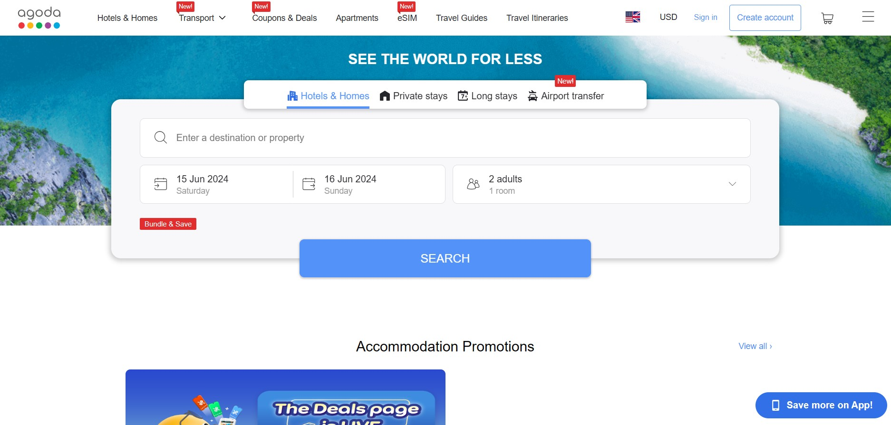
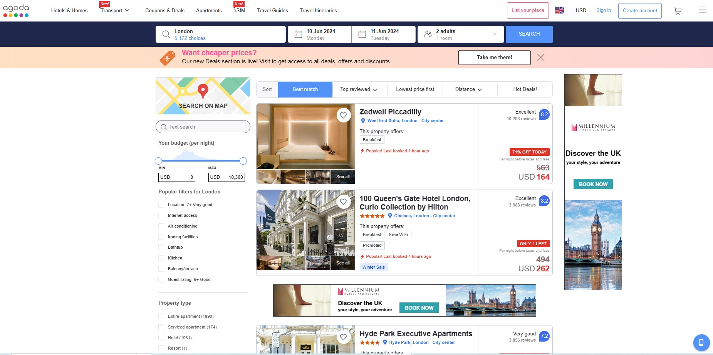
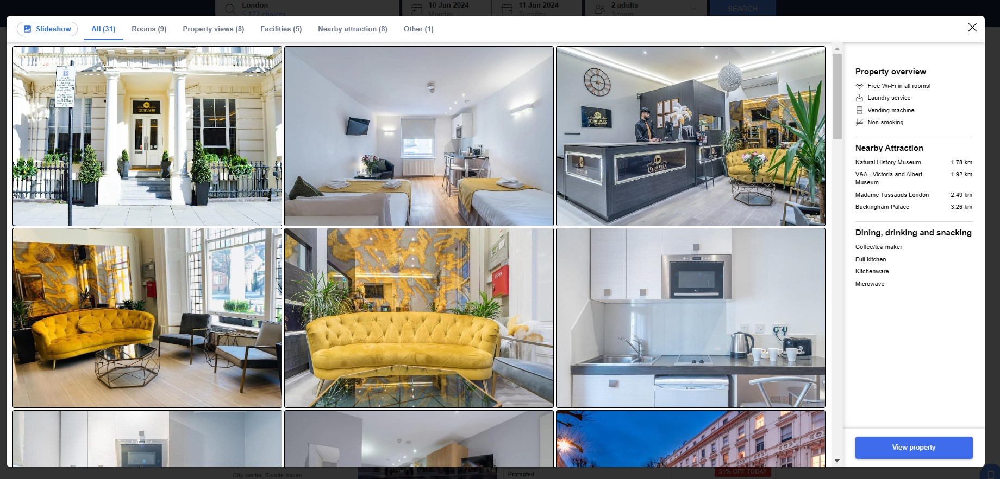
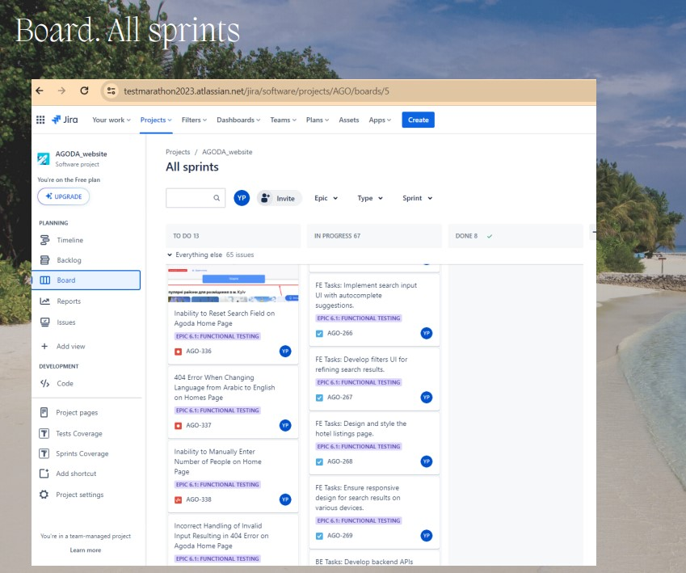
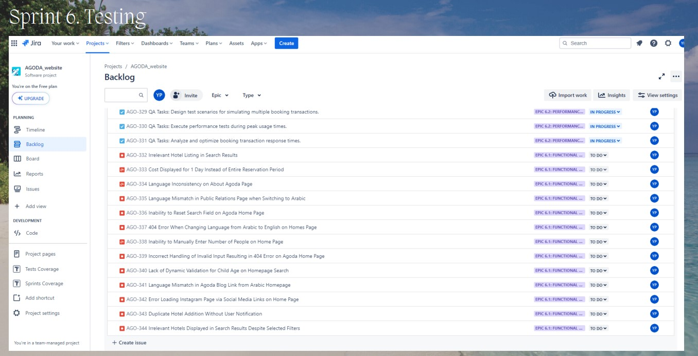
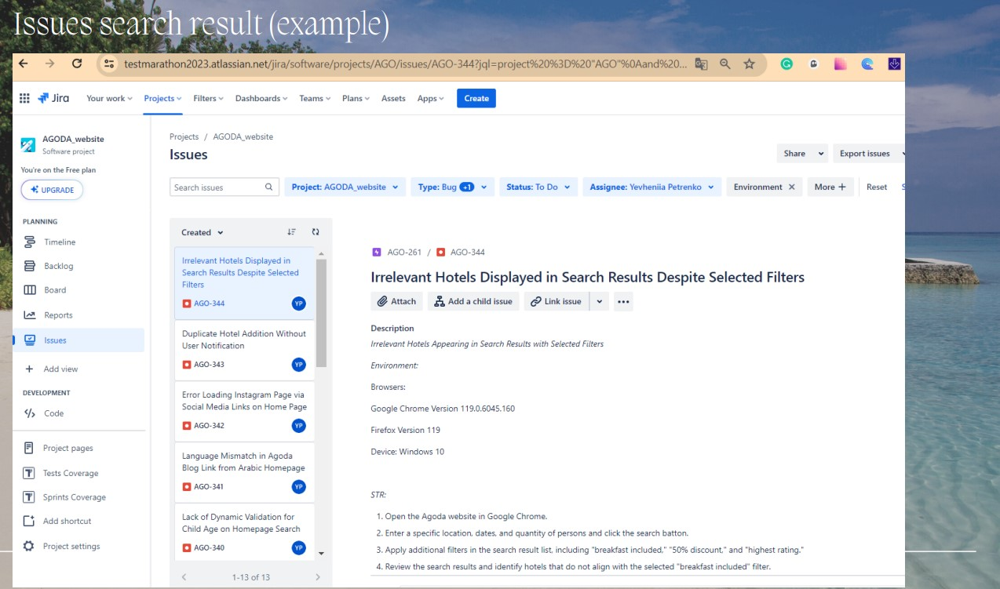
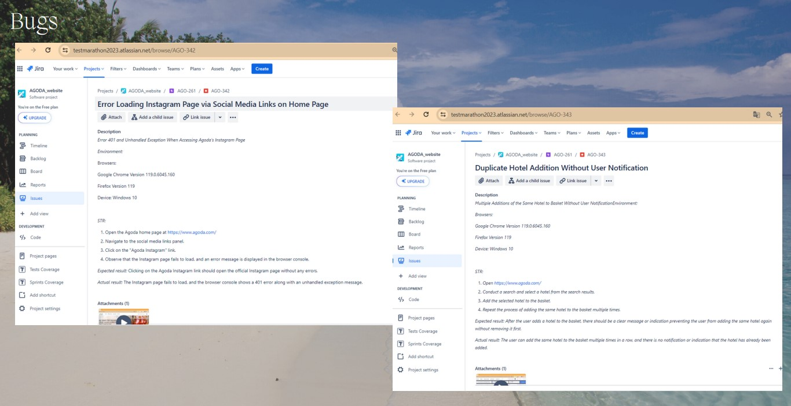

# Creating a project in Jira for  agoda .com website
Manual Software Testing

## Don't forget to give a :star: to make the project popular :) 

## :boom: The task and what needs to be done?
- Register in Jiga.
- Create a project in which to create Ерісѕ for different parts of the project.
- Take, for example, the Agoda project or any other.
- Create User Stories.
- Create tasks. There must be tasks for Test Design and Test Execution.
- Find and bring a number of bugs from Agoda to Jiga. Set up a few filters and save.
- Make reports in pdf format.

 

## :bulb: The result:
- Registered in Jira.
- A project for the agoda .com website was created, in which Ерісѕ for various parts of the project were created.
- User Stories were created.
- Tasks for Test Design and Test Execution were created.
- A number of bugs from Agoda were found and logged in Jiga.
- The reports were prepared in pdf format.

 

 

 

 

 

